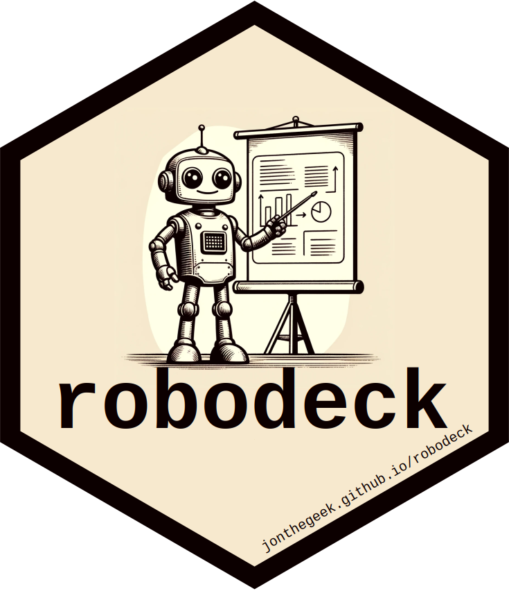

<!-- README.md is generated from README.Rmd. Please edit that file -->

# robodeck <a href="https://jonthegeek.github.io/robodeck/"></a>

<!-- badges: start -->

[](https://lifecycle.r-lib.org/articles/stages.html#experimental)
[](https://CRAN.R-project.org/package=robodeck)
[](https://app.codecov.io/gh/jonthegeek/robodeck?branch=main)
[](https://github.com/jonthegeek/robodeck/actions/workflows/R-CMD-check.yaml)
<!-- badges: end -->

Sometimes it’s easier to *edit* a deck than to *create* one from
scratch. Enter robodeck!

This extremely experimental package uses the [OpenAI
API](https://platform.openai.com/docs/api-reference/) to generate Quarto
slide decks quickly.

## Installation

You can install the development version of robodeck from
[GitHub](https://github.com/) with:

``` r
# install.packages("pak")
pak::pak("jonthegeek/robodeck")
```

## Usage

We do not recommend using the output of this package without editing.
That said, the deck below was generated without editing, as an example.

``` r
library(robodeck)
description <- 
  "robodeck is an R package that utilizes the OpenAI API 
   (https://platform.openai.com/docs/api-reference/) to quickly generate Quarto 
   slide decks. In this lightning talk I will demonstrate how to use 
   robodeck::gen_deck() to automatically generate a slide deck from just a title 
   and description, and why you should carefully edit the results!" |> 
  stringr::str_squish()

# Store an API key in an environment variable called OPENAI_API_KEY.

deck_markdown <- gen_deck(
  title = "Introducing robodeck",
  description = description,
  minutes = 5
)
```

    #> |  # Demonstration
    #> |  
    #> |  ---
    #> |  
    #> |  ## Generating a basic slide deck with robodeck
    #> |  
    #> |  ```{r}
    #> |  # Generate a basic slide deck with robodeck::gen_deck()
    #> |  ```
    #> |  
    #> |  
    #> |  
    #> |  - 👾 Simply call `robodeck::gen_deck()` to create a slide deck automatically!
    #> |  
    #> |  ---
    #> |  
    #> |  ## Viewing the automatically generated slide content
    #> |  
    #> |  ```{r}
    #> |  # View the automatically generated slide content
    #> |  ```
    #> |  
    #> |  
    #> |  
    #> |  - 👀 Check out the slides generated from just a title and description!
    #> |  
    #> |  ---
    #> |  
    #> |  # Editing Best Practices
    #> |  
    #> |  ---
    #> |  
    #> |  ## Reviewing and refining slide content
    #> |  
    #> |  ```{r}
    #> |  # Reviewing and refining automatically generated content
    #> |  ```
    #> |  
    #> |  
    #> |  
    #> |  - 🧐 Take a closer look at the content and make necessary adjustments!
    #> |  
    #> |  ---
    #> |  
    #> |  ## Adding personal touches and customizations
    #> |  
    #> |  ```{r}
    #> |  # Adding personal touches and customizations
    #> |  ```
    #> |  
    #> |  
    #> |  
    #> |  - 🎨 Add your personal flair and make the slide deck uniquely yours!

Note that function calls will hit the OpenAI API, which is not free. At
the time of this writing, experiments with the API while writing this
package have incurred a total cost of about \$0.13, almost all of that
while experimenting with the more expensive “GPT-4-turbo” API. By
default, robodeck uses the “GPT-3.5-turbo” API, which should cost
\<\$0.01 to generate a deck.

## Code of Conduct

Please note that the robodeck project is released with a [Contributor
Code of
Conduct](https://jonthegeek.github.io/robodeck/CODE_OF_CONDUCT.html). By
contributing to this project, you agree to abide by its terms.
